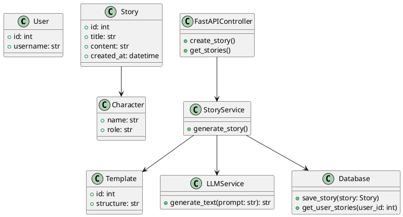
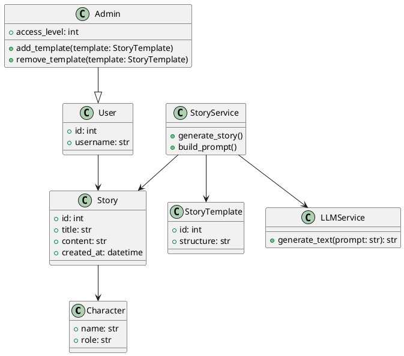
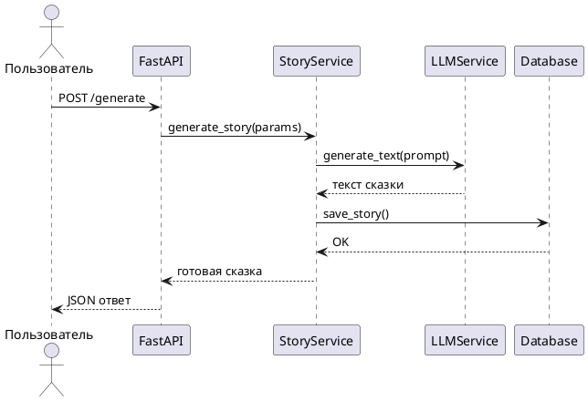
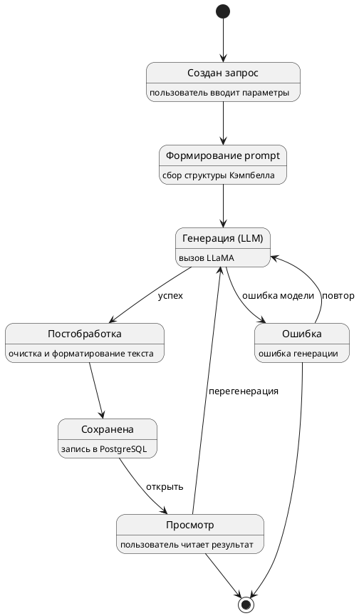
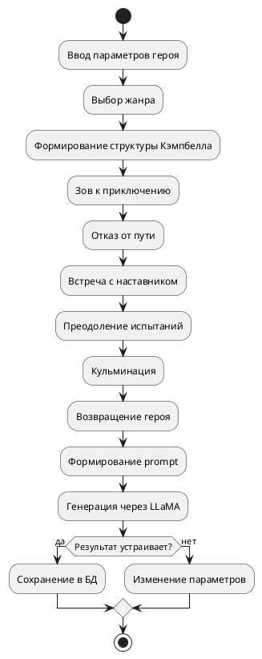

# Предмет: Языки написания спецификаций.

## Задание 2. Создание диаграмм для ВКР

### 1. Диаграммы 

#### 1.1. Диаграмма вариантов использования.

Code: 
```plantumlcode
@startuml
class User {
  +id: int
  +username: str
}

class Story {
  +id: int
  +title: str
  +content: str
  +created_at: datetime
}

class Character {
  +name: str
  +role: str
}

class Template {
  +id: int
  +structure: str
}

class StoryService {
  +generate_story()
}

class LLMService {
  +generate_text(prompt: str): str
}

class Database {
  +save_story(story: Story)
  +get_user_stories(user_id: int)
}

class FastAPIController {
  +create_story()
  +get_stories()
}

FastAPIController --> StoryService
StoryService --> LLMService
StoryService --> Database
Story --> Character
StoryService --> Template
@enduml
```


out: 



#### 1.2 Диаграмма классов.
Code: 
```plantumlcode
@startuml

class Character {
  +name: str
  +role: str
}

class StoryTemplate {
  +id: int
  +structure: str
}

class Story {
  +id: int
  +title: str
  +content: str
  +created_at: datetime
}

class User {
  +id: int
  +username: str
}

class Admin {
  +access_level: int
  +add_template(template: StoryTemplate)
  +remove_template(template: StoryTemplate)
}

class StoryService {
  +generate_story()
  +build_prompt()
}

class LLMService {
  +generate_text(prompt: str): str
}

User --> Story
Story --> Character
StoryService --> Story
StoryService --> StoryTemplate
StoryService --> LLMService

Admin --|> User

@enduml
```


out: 



#### 1.3 Диаграмма последовательности.
Code:
```plantumlcode
@startuml
actor Пользователь
participant FastAPI
participant StoryService
participant LLMService
participant Database

Пользователь -> FastAPI: POST /generate
FastAPI -> StoryService: generate_story(params)
StoryService -> LLMService: generate_text(prompt)
LLMService --> StoryService: текст сказки
StoryService -> Database: save_story()
Database --> StoryService: OK
StoryService --> FastAPI: готовая сказка
FastAPI --> Пользователь: JSON ответ
@enduml
```

Out:



#### 1.4 Диаграмма состояний.
Code:
```plantumlcode
@startuml

state "Создан запрос" as Created : пользователь вводит параметры
state "Формирование prompt" as Prompt : сбор структуры Кэмпбелла
state "Генерация (LLM)" as Generating : вызов LLaMA
state "Постобработка" as Post : очистка и форматирование текста
state "Сохранена" as Saved : запись в PostgreSQL
state "Ошибка" as Error : ошибка генерации
state "Просмотр" as Viewed : пользователь читает результат

[*] --> Created

Created --> Prompt
Prompt --> Generating

Generating --> Post : успех
Generating --> Error : ошибка модели

Post --> Saved

Saved --> Viewed : открыть

Viewed --> Generating : перегенерация

Error --> Generating : повтор
Error --> [*]

Viewed --> [*]

@enduml
```

Out:


#### 1.5. Диаграмма деятельности.
Code:
```plantumlcode
@startuml
start

:Ввод параметров героя;
:Выбор жанра;

:Формирование структуры Кэмпбелла;

:Зов к приключению;
:Отказ от пути;
:Встреча с наставником;
:Преодоление испытаний;
:Кульминация;
:Возвращение героя;

:Формирование prompt;

:Генерация через LLaMA;

if (Результат устраивает?) then (да)
  :Сохранение в БД;
else (нет)
  :Изменение параметров;
endif

stop
@enduml
```

Out:



### 2. UI.

+ код можно посмотреть тут [ссылка на репозиторий](https://github.com/Kvazistam/Fairytalegeneratorui)
+ Сам сайт можно посмотреть тут. [ссылка на сайт](https://dusk-galaxy-70917595.figma.site/)
