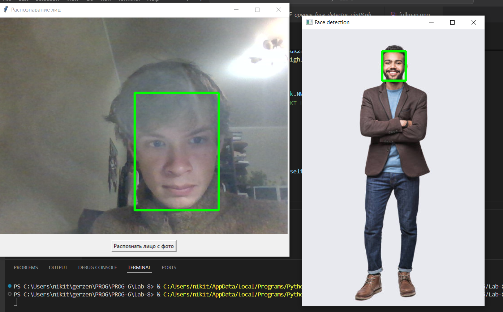

# Отчет по Лабораторной работе № 8.
**Выполнил:** Маковеев Никита Владимирович.
------

## Постановка задачи.
В данной работе было необходимо повторить код из статьи [ссылка на статью](https://thecode.media/cv2/). И переделать его, чтобы была возможность распознавать лицо с фотографии, а не только с камеры ноутбука. Так же сделать простой UI для работы с программой.

## Результаты работы.

Работа выполненая в полной мере, для UI была использована библиотека Tkinter.

+ В файле app.py написана основная часть UI плюс запуск модели для обработки изображений.
+ В файле face_detection.py описана вся логика модели.
+ в папке model лежат веса модели
+ в папке images лежат примеры фотографий для тестирования модели.

### Скриншоты.
 
